Text Mining Kickstarter Projects
================================


```r
library(tidyverse)
library(ggplot2)
library(tm)
library(stringr)
library(textstem)
library(quanteda)
library(tidytext)
library(corpus)
library(wordcloud)
library(ggthemes)
library(DT)

df <- read.csv("/Users/yanlinzhang/Desktop/Data Visualization/assignment-3---kickstarter-calvinzyl/kickstarter_projects_2021-05.csv")
```

### 1. Identifying Successful Projects

#### a) Success by Category


```r
success <- df %>% 
  select("top_category", "sub_category", "state", "pledged", "backers_count", "launched_at", "state_changed_at", "goal") %>%
  mutate("achievement_ratio" = (pledged/goal)*100) %>% 
  mutate("speed" = difftime(state_changed_at, launched_at, unit = "days")) %>% 
  group_by(top_category) %>%
            summarise(achievement_ratio_avg = mean(achievement_ratio),
                      speed_avg = mean(speed),
                      backers_avg = mean(backers_count),
                      .groups='drop')

success1 <- success %>% 
  arrange(desc(achievement_ratio_avg)) %>% 
  slice(1:10)
  
successful_projects1 <- ggplot(success1, aes(x=reorder(top_category, -achievement_ratio_avg),
                                           y=achievement_ratio_avg)) + 
  geom_bar(stat="identity", width=0.7) + 
  labs(y="Average Achievement Ratio",
       x="Category") +
  theme(axis.text.x = element_text(size=12),
        axis.title.x = element_blank()) +
  theme_clean() +
  ggtitle("Top 10 Most Successful Categories based on Achievement Ratio")

successful_projects1
```

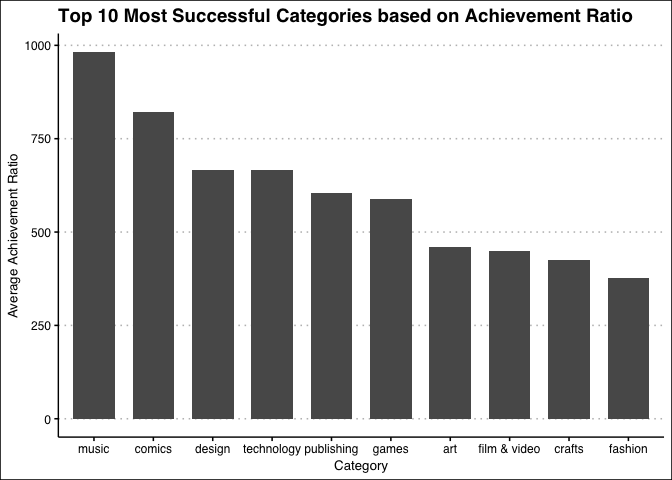<!-- -->


This graph shows that the top categories are music, comic, design, technology, publishing, etc., based on the achievement ratio. Projects on those categories have relatively higher percentage of original monetary goal reached by the actual amount pledged.


```r
success2 <- success %>% 
  arrange(desc(speed_avg)) %>% 
  slice(1:10)
  
successful_projects2 <- ggplot(success2, aes(x=reorder(top_category, speed_avg),
                                           y=speed_avg)) + 
  geom_bar(stat="identity", width=0.7) + 
  labs(y="Average Speed goal was reached",
       x="Category") +
  theme(axis.text.x = element_text(size=12),
        axis.title.x = element_blank()) +
  theme_clean() +
  ggtitle("Top 10 Most Successful Categories based on Speed goal was reached")

successful_projects2
```

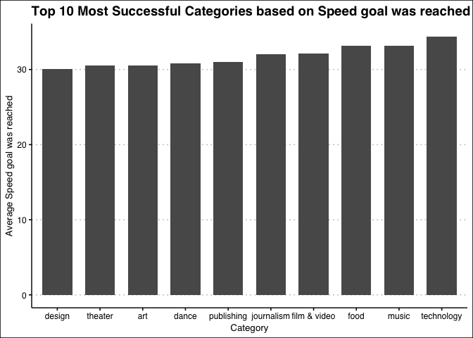<!-- -->


This graph shows that design, theater, art, dance, and publishing are the top categories that cost relatively shorter time for projects to reach the monetary goals. Design and technology are aligned with the previous graph.


```r
success3 <- success %>% 
  arrange(desc(achievement_ratio_avg)) %>% 
  slice(1:10)
  
successful_projects3 <- ggplot(success3, aes(x=reorder(top_category, -backers_avg),
                                           y=backers_avg)) + 
  geom_bar(stat="identity", width=0.7) + 
  labs(y="Average Backers",
       x="Category") +
  theme(axis.text.x = element_text(size=12),
        axis.title.x = element_blank()) +
  theme_clean() +
  ggtitle("Top 10 Most Successful Categories based on Backers")

successful_projects3
```

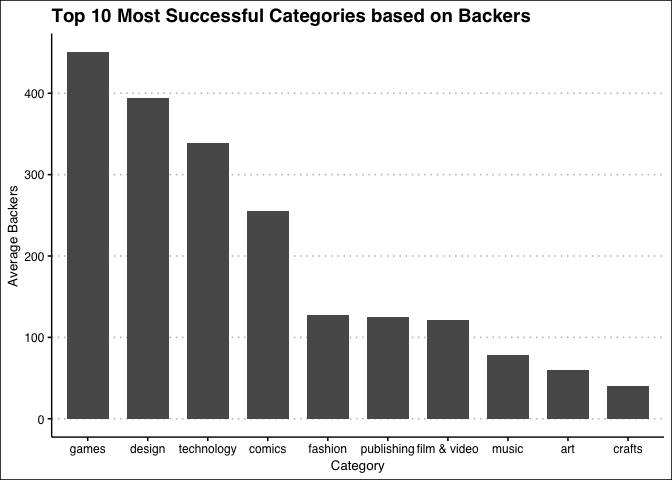<!-- -->


This graph shows that games, design, technology, comics, and fashion are the top categories that have most backers. Games, design, and technology in particularly all have more than 300 backers per project, on average, which is cool. Based on all three graphs, design, technology, and fashion are the categories that are consistently at the top even based on different metrics.

### 2. Writing your success story

#### a) Cleaning the Text and Word Cloud


```r
success_failure <- df %>% 
  select("blurb", "state", "pledged", "goal", "id") %>%
  mutate("achievement_ratio" = (pledged/goal)*100)

most_successful <- success_failure %>% 
  arrange(desc(achievement_ratio)) %>% 
  slice(1: 1000) %>% 
  select(blurb) %>% 
  pull()

most_unsuccessful <- success_failure %>% 
  arrange(achievement_ratio) %>% 
  slice(1: 1000) %>% 
  select(blurb) %>% 
  pull()

success_corpus <- Corpus(VectorSource(most_successful))
failure_corpus <- Corpus(VectorSource(most_unsuccessful))
```


```r
clean_corpus <- function(corpus){
  corpus <- tm_map(corpus, removePunctuation)
  corpus <- tm_map(corpus, content_transformer(tolower))
  corpus <- tm_map(corpus, removeWords, c(stopwords("en")))
  corpus <- tm_map(corpus, removeNumbers)
  corpus <- tm_map(corpus, stripWhitespace)
  corpus <- tm_map(corpus, lemmatize_strings)
  return(corpus)
}
  
success_corpus_cleaned = clean_corpus(success_corpus)
```

```
## Warning in tm_map.SimpleCorpus(corpus, removePunctuation): transformation drops
## documents
```

```
## Warning in tm_map.SimpleCorpus(corpus, content_transformer(tolower)):
## transformation drops documents
```

```
## Warning in tm_map.SimpleCorpus(corpus, removeWords, c(stopwords("en"))):
## transformation drops documents
```

```
## Warning in tm_map.SimpleCorpus(corpus, removeNumbers): transformation drops
## documents
```

```
## Warning in tm_map.SimpleCorpus(corpus, stripWhitespace): transformation drops
## documents
```

```
## Warning in tm_map.SimpleCorpus(corpus, lemmatize_strings): transformation drops
## documents
```

```r
failure_corpus_cleaned = clean_corpus(failure_corpus)
```

```
## Warning in tm_map.SimpleCorpus(corpus, removePunctuation): transformation drops
## documents
```

```
## Warning in tm_map.SimpleCorpus(corpus, content_transformer(tolower)):
## transformation drops documents
```

```
## Warning in tm_map.SimpleCorpus(corpus, removeWords, c(stopwords("en"))):
## transformation drops documents
```

```
## Warning in tm_map.SimpleCorpus(corpus, removeNumbers): transformation drops
## documents
```

```
## Warning in tm_map.SimpleCorpus(corpus, stripWhitespace): transformation drops
## documents
```

```
## Warning in tm_map.SimpleCorpus(corpus, lemmatize_strings): transformation drops
## documents
```

```r
success_tdm <- TermDocumentMatrix(success_corpus_cleaned)
failure_tdm <- TermDocumentMatrix(failure_corpus_cleaned)
success_dtm <- DocumentTermMatrix(success_corpus_cleaned)
failure_dtm <- DocumentTermMatrix(failure_corpus_cleaned)

success_m <- as.matrix(success_tdm)
failure_m <- as.matrix(failure_tdm)
success_m1 <- as.matrix(success_dtm)
failure_m1 <- as.matrix(failure_dtm)
```


```r
success_td <- tidy(success_tdm)
success_td <- success_td %>%
  mutate(lemma = lemmatize_words(term))

failure_td <- tidy(failure_tdm)
failure_td <- failure_td %>%
  mutate(lemma = lemmatize_words(term))

success_td_viz <- success_td %>% 
  group_by(lemma) %>%
  summarise(n = sum(count)) %>%
  top_n(n = 20, wt = n)  %>%
  ungroup() %>%
  mutate(term = reorder(lemma, n))

failure_td_viz <- failure_td %>% 
  group_by(lemma) %>%
  summarise(n = sum(count)) %>%
  top_n(n = 20, wt = n)  %>%
  ungroup() %>%
  mutate(term = reorder(lemma, n))

success_word_freq <- ggplot(data=success_td_viz, aes(reorder(lemma, n), n)) +
  geom_bar(stat = "identity") +
  theme_fivethirtyeight() +
  geom_text(aes(label=lemma, x=lemma, y=2), hjust = 0,
            color="white", size = 3.2) +
  geom_text(aes(label=n, x=lemma, y=n-1), hjust = 1,
            color="white", size = 3.2) +
  xlab(NULL) +  coord_flip() +
  theme(axis.title.y=element_blank(),
        axis.title.x=element_blank(),
        axis.text.y=element_blank(),
        axis.ticks.y=element_blank()) +
  ggtitle("Most frequent terms in Top 20 Successful Projects") +
  theme(plot.title = element_text(size = 9.5))

failure_word_freq <- ggplot(data=failure_td_viz, aes(reorder(lemma, n), n)) +
  geom_bar(stat = "identity") +
  theme_fivethirtyeight() +
  geom_text(aes(label=lemma, x=lemma, y=2), hjust = 0,
            color="white", size = 3.2) +
  geom_text(aes(label=n, x=lemma, y=n-1), hjust = 1,
            color="white", size = 3.2) +
  xlab(NULL) +  coord_flip() +
  theme(axis.title.y=element_blank(),
        axis.title.x=element_blank(),
        axis.text.y=element_blank(),
        axis.ticks.y=element_blank()) +
  ggtitle("Most frequent terms in Top 20 Unsuccessful Projects") +
  theme(plot.title = element_text(size = 9.5))

library(patchwork)

success_word_freq + failure_word_freq
```

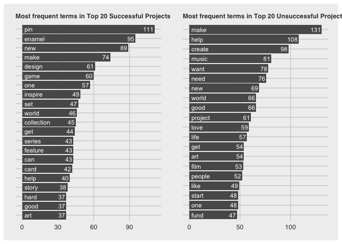<!-- -->


```r
success_td_wc <- success_td %>% 
  group_by(lemma) %>%
  summarise(n = sum(count)) %>% 
  mutate(binary = "successful")

set.seed(42)

purple_orange <- brewer.pal(10, "PuOr")
purple_orange <- purple_orange[-(1:2)]

wc1 <- wordcloud(success_td_wc$lemma, success_td_wc$n,
         max.words = 100, colors = purple_orange)
```

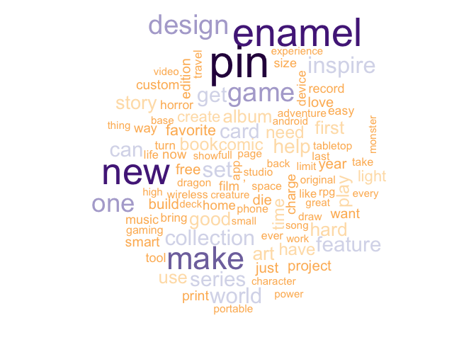<!-- -->


This is a word cloud of the most frequent words among the most successful projects. Top words include "pin", "new", "make", "game", etc.


```r
failure_td_wc <- failure_td %>% 
  group_by(lemma) %>%
  summarise(n = sum(count)) %>% 
  mutate(binary = "unsuccessful")

set.seed(42)

purple_orange <- brewer.pal(10, "PuOr")
purple_orange <- purple_orange[-(1:2)]

wc2 <- wordcloud(failure_td_wc$lemma, failure_td_wc$n,
         max.words = 100, colors = purple_orange)
```

```
## Warning in wordcloud(failure_td_wc$lemma, failure_td_wc$n, max.words = 100, :
## make could not be fit on page. It will not be plotted.
```

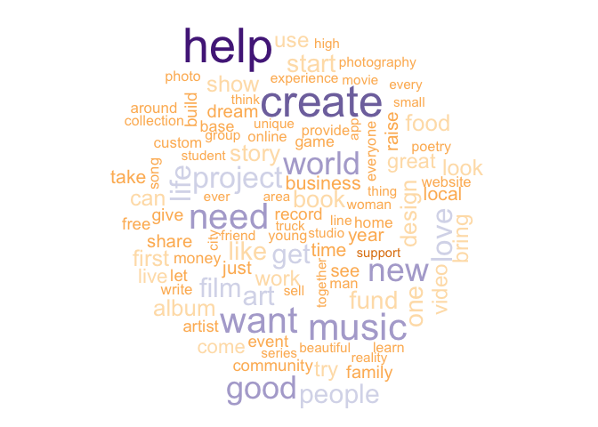<!-- -->


This is a word cloud of the most frequent words among the unsuccessful projects. Top words include "help", "create", "want", "need", etc.

#### b) Success in words


```r
library(plotrix)

combined <- merge(success_td_wc, failure_td_wc, by = 'lemma')
top20_prep <- combined %>% 
  arrange(desc(n.x)) %>% 
  slice(1:20)

top20_suc <- top20_prep %>% 
  select("lemma", "n.x", "binary.x") %>% 
  rename("frequency" = "n.x") %>% 
  rename("binary" = "binary.x")

top20_fal <- top20_prep %>% 
  select("lemma", "n.y", "binary.y") %>% 
  rename("frequency" = "n.y") %>% 
  rename("binary" = "binary.y")

top20 <- rbind(top20_suc, top20_fal)

ggplot(top20, aes(x = reorder(lemma, frequency), fill=binary,,
                  y = ifelse(test = binary == "successful",
                             yes = -frequency, no = frequency))) +
  geom_bar(data = filter(top20, binary == "successful"), stat = "identity") +
  geom_bar(data = filter(top20, binary == "unsuccessful"), stat = "identity") +
  scale_fill_brewer(palette = "Accent", direction=-1) + coord_flip()  + ylab("") +
  ggtitle("Top 20 most frequenct words comparison") +
  theme(axis.title.y = element_text(size = 12),
        axis.title.x = element_text(size = 13)) +
  labs(x="Most Frequent Words", y="Frequency", fill="Successfulness") +
  theme_pander()
```

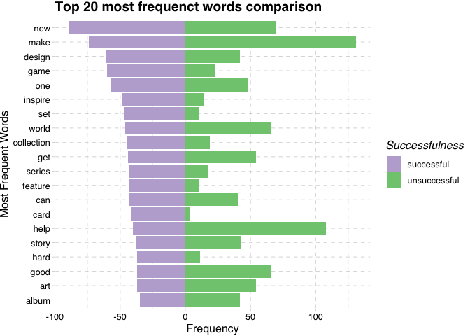<!-- -->


The pyramid plot above shows the top 20 most frequency common words shared by successful and unsuccessful projects. Both have "make", "world", and "get" pretty frequently, but unsuccessful ones have a lot fewer "inspire", "set", "card", etc.

#### c) Simplicity as a virtue


```r
require(quanteda.textstats)

most_successful1 <- success_failure %>% 
  select("blurb", "achievement_ratio") %>% 
  arrange(desc(achievement_ratio)) %>% 
  slice(1: 1000)

success_metrics <- textstat_readability(most_successful1$blurb, 
        measure=c('Flesch','Flesch.Kincaid',
                  'meanSentenceLength','meanWordSyllables'))

success_metrics_viz <- data.frame(most_successful1, success_metrics)
success_metrics_viz <- success_metrics_viz %>% 
  mutate(binary = "successful")

most_unsuccessful1 <- success_failure %>%
  select("blurb", "achievement_ratio") %>% 
  arrange(achievement_ratio) %>% 
  slice(1: 1000)

failure_metrics <- textstat_readability(most_unsuccessful1$blurb, 
        measure=c('Flesch','Flesch.Kincaid',
                  'meanSentenceLength','meanWordSyllables'))

failure_metrics_viz <- data.frame(most_unsuccessful1, failure_metrics)
failure_metrics_viz <- failure_metrics_viz %>% 
  mutate(binary = "unsuccessful")

metrics_viz <- rbind(success_metrics_viz, failure_metrics_viz)
metrics_viz <- metrics_viz %>% 
  select("achievement_ratio", "Flesch", "Flesch.Kincaid", "binary")

library(ggpubr)

score1 <- ggplot(metrics_viz, aes(x = Flesch, y= achievement_ratio,
                        color = binary)) +
  geom_point(alpha=0.8, size = 0.8) +
  theme_pander() +
  labs(y="Achievement Ratio", x="Flesch Reading Ease Score") + 
  ggtitle("Reading Ease Scores V.S. Achievement Ratio") +
  theme(plot.title = element_text(size = 14, hjust = 0.5),
        axis.title.x=element_text(size = 13),
        axis.title.y=element_text(size = 13),
        legend.position = "none") +
  coord_cartesian(xlim = c(-100, 150), ylim = c(0, 3.5e+06))

score2 <- ggplot(metrics_viz, aes(x = Flesch.Kincaid, y= achievement_ratio,
                        color = binary)) +
  geom_point(alpha=0.8, size = 0.8) +
  theme_pander() +
  labs(y="Achievement Ratio", x="Flesch-Kincaid Reading Ease Score",
       fill = "Successfulness")  +
  theme(plot.title = element_text(size = 15, hjust = 0.5),
        axis.title.x=element_text(size = 13),
        axis.title.y=element_text(size = 13)) +
  coord_cartesian(xlim = c(-100, 150), ylim = c(0, 3.5e+06))

score1 / score2
```

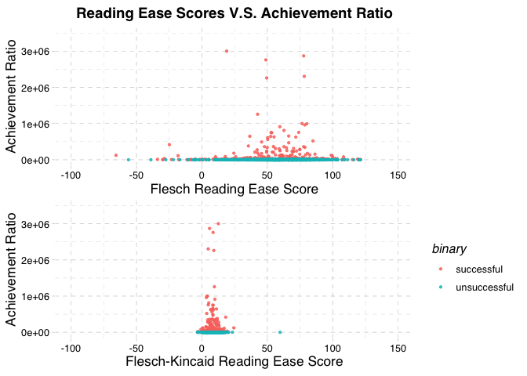<!-- -->


Both scatterplots show that there are not an obvious directional associations between readability and successfulness. For unsuccessful projects, there reading ease score varies a lot, and so does the successful ones that scatter across the plot kind of randomly. Maybe in terms of Flesch score there might be a very flat positive relationship, but in general I suppose the reading ease of those project blurbs does not necessarily strongly correlate with how successful they are going to be.

### 3. Sentiment

#### a) Stay positive


```r
word_tb <- df %>% 
  select("blurb", "id", "launched_at", "state_changed_at") %>%
  mutate("speed" = difftime(state_changed_at, launched_at, unit = "days")) %>% 
  unnest_tokens(word, blurb) %>% 
  inner_join(get_sentiments("bing")) %>% 
  mutate(word = 1) %>% 
  pivot_wider(names_from = sentiment, values_from = word,
              values_fn = sum, values_fill = 0) %>% 
  mutate(score = ((positive-negative)/(positive+negative)))


 ggplot(word_tb, aes(y = speed, x = score)) +
  geom_point(alpha=0.5, size = 1.1) +
  theme_pander() +
  labs(y = "Efficiency of Completion",
       x = "Sentiment Polarity Score computed from Bing lexicon") + 
  ggtitle("Association between Tone of the document and Success") +
  theme(plot.title = element_text(size = 14, hjust = 0.5),
        axis.title.x=element_text(size = 13),
        axis.title.y=element_text(size = 13)) +
  geom_smooth() +
  stat_cor(label.y = 75, label.x = -0.75) +
  stat_regline_equation(label.y = 80, label.x = -0.75)
```

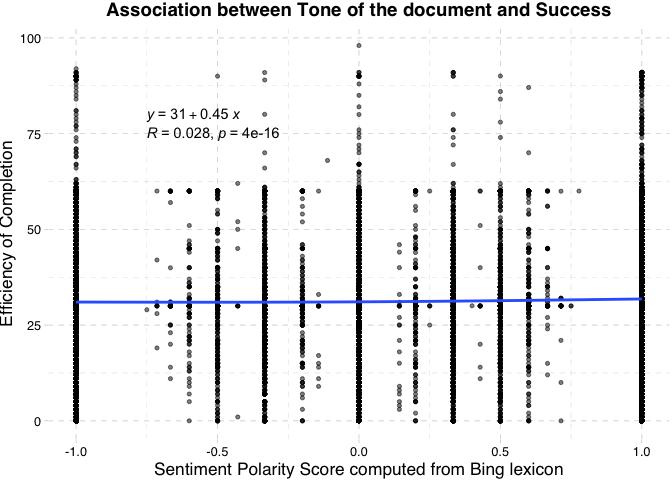<!-- -->


I computed the sentiment polarity score based on the common formula (#positive - #negative)/(#positive + #negative) with regard to each document. This metric against speed shows a positive, statistically significant fitting line, which means on average for every unit increase in sentiment polarity score will take the project 0.45 more days to reach the goal, which is an interesting observation. This association does not have a good predictive power, but the explanatory power is quite strong (lots of omitted variables of course). I will still say there is hardly an association to be drawn decisively.

#### b) Positive vs negative


```r
id <- df %>% 
  select("id", "blurb")

positive <- word_tb %>% 
  filter(score > 0) %>% 
  merge(df, by = "id") %>% 
  select("blurb", "score") %>% 
  arrange(desc(score)) %>% 
  slice(1: 1000)

positive_join <- paste(positive$blurb, collapse=" ")

negative <- word_tb %>% 
  filter(score < 0) %>% 
  merge(df, by = "id") %>% 
  select("blurb", "score") %>% 
  arrange(score) %>% 
  slice(1: 1000)

negative_join <- paste(negative$blurb, collapse=" ")

big_join <- c(positive_join, negative_join)
big_corpus <- Corpus(VectorSource(big_join))
big_corpus_cleaned <- clean_corpus(big_corpus)
```

```
## Warning in tm_map.SimpleCorpus(corpus, removePunctuation): transformation drops
## documents
```

```
## Warning in tm_map.SimpleCorpus(corpus, content_transformer(tolower)):
## transformation drops documents
```

```
## Warning in tm_map.SimpleCorpus(corpus, removeWords, c(stopwords("en"))):
## transformation drops documents
```

```
## Warning in tm_map.SimpleCorpus(corpus, removeNumbers): transformation drops
## documents
```

```
## Warning in tm_map.SimpleCorpus(corpus, stripWhitespace): transformation drops
## documents
```

```
## Warning in tm_map.SimpleCorpus(corpus, lemmatize_strings): transformation drops
## documents
```

```r
big_tdm <- TermDocumentMatrix(big_corpus_cleaned)
big_dtm <- DocumentTermMatrix(big_corpus_cleaned)
big_m <- as.matrix(big_tdm)
big_m2 <- as.matrix(big_dtm)
```


```r
pos_neg <- data.frame(big_m)
pos_neg <- pos_neg %>% 
  rename(Positive = X1,
         Negative = X2)

par(mfrow=c(1, 1))
comparison.cloud(pos_neg, colors = c("indianred3", "lightsteelblue3"),
                 scale=c(0.2, 1.5), title.size= 1.8, random.order = FALSE,
                 max.words = 100)
```

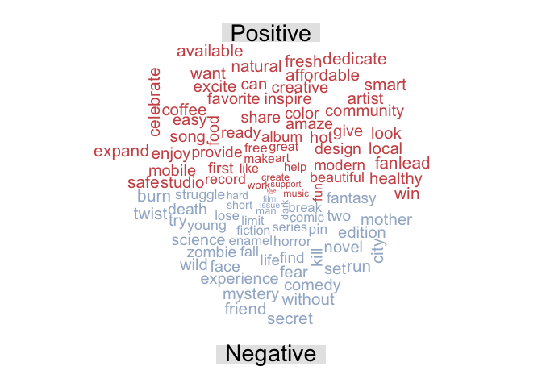<!-- -->

#### c) Get in their mind


```r
src_score <- df %>% 
  select("blurb", "id", "launched_at", "state_changed_at") %>%
  mutate("speed" = difftime(state_changed_at, launched_at, unit = "days")) %>% 
  unnest_tokens(word, blurb) %>% 
  inner_join(get_sentiments("nrc")) %>% 
  mutate(word = 1) %>% 
  pivot_wider(names_from = sentiment, values_from = word,
              values_fn = sum, values_fill = 0) %>% 
  select(-(launched_at: state_changed_at)) %>% 
  mutate(score = ((positive + joy + trust + surprise + anticipation) - 
                    (anger + disgust + negative + fear + sadness)))

 ggplot(src_score, aes(y = speed, x = score)) +
  geom_point(alpha=0.5, size = 1.1) +
  theme_pander() +
  labs(y = "Efficiency of Completion",
       x = "Sentiment computed from NRC Word-Emotion Association Lexicon") + 
  ggtitle("Association between Emotion of document and Success") +
  theme(plot.title = element_text(size = 14, hjust = 0.5),
        axis.title.x=element_text(size = 13),
        axis.title.y=element_text(size = 13)) +
  geom_smooth() +
  stat_cor(label.y = 75, label.x = -15) +
  stat_regline_equation(label.y = 80, label.x = -15)
```

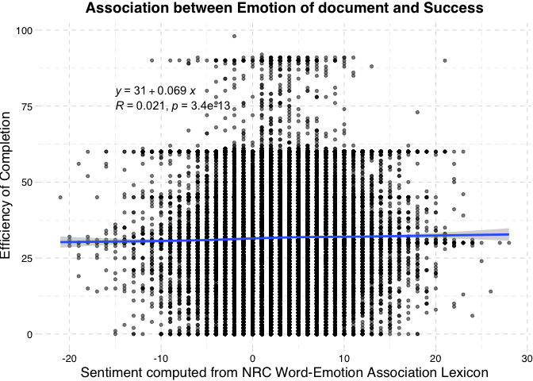<!-- -->


The sentiment score here is the difference between the count of all five positive words and that of all five negative words, per each document, based on the NRC emotion lexicon. Again, there is a very flat increasing trend of positivity on the days needed for project completion. However, similar with 3(a), this trend is too flat to jump to any conclusion regarding the association between sentiment and speed, although the p-value is very small.


```r
src_score2 <- df %>% 
  select("blurb", "id", "state") %>%
  unnest_tokens(word, blurb) %>% 
  inner_join(get_sentiments("nrc")) %>% 
  mutate(word = 1) %>% 
  pivot_wider(names_from = sentiment, values_from = word,
              values_fn = sum, values_fill = 0) %>% 
  group_by(state) %>% 
  summarise(positive = mean(positive),
            joy = mean(joy),
            trust = mean(trust),
            surprise = mean(surprise),
            anticipation = mean(anticipation),
            fear = mean(fear),
            sadness = mean(sadness),
            disgust = mean(disgust),
            anger = mean(anger),
            negative = mean(negative))

datatable(src_score2)
```

```{=html}
<div id="htmlwidget-7d8890e57b872a97dd6d" style="width:100%;height:auto;" class="datatables html-widget"></div>
<script type="application/json" data-for="htmlwidget-7d8890e57b872a97dd6d">{"x":{"filter":"none","vertical":false,"data":[["1","2","3","4"],["canceled","failed","live","successful"],[1.73030655801319,1.79792371925073,1.43523676880223,1.65429917550059],[0.835855646100116,0.901038140374633,0.659470752089137,0.8275060442626],[0.843034536282499,0.859331979237193,0.706824512534819,0.761809559233773],[0.354870003880481,0.357052584066802,0.340529247910864,0.400889591469841],[0.735739231664726,0.76962310990747,0.62883008356546,0.746140970801562],[0.346720993403182,0.308914466260438,0.37116991643454,0.361353914822392],[0.357004268529298,0.359061160009027,0.327298050139276,0.41052941541132],[0.152696934419868,0.130354321823516,0.173398328690808,0.161056351125163],[0.270275514163756,0.253599638907696,0.282729805013928,0.285025726861323],[0.491462941404734,0.454141277364026,0.515320334261838,0.519248651664497]],"container":"<table class=\"display\">\n  <thead>\n    <tr>\n      <th> <\/th>\n      <th>state<\/th>\n      <th>positive<\/th>\n      <th>joy<\/th>\n      <th>trust<\/th>\n      <th>surprise<\/th>\n      <th>anticipation<\/th>\n      <th>fear<\/th>\n      <th>sadness<\/th>\n      <th>disgust<\/th>\n      <th>anger<\/th>\n      <th>negative<\/th>\n    <\/tr>\n  <\/thead>\n<\/table>","options":{"columnDefs":[{"className":"dt-right","targets":[2,3,4,5,6,7,8,9,10,11]},{"orderable":false,"targets":0}],"order":[],"autoWidth":false,"orderClasses":false}},"evals":[],"jsHooks":[]}</script>
```


Above is a small data table showing the average score of each emotion across four states of projects. We can see more things here. For example, successful projects reflect more surprise, fear, yet less joy, positivity, or trust. This in turn shows that more successful projects might actually reveal less positive mindsets, could be due to too much stress and fear of losing them, while less successful project owners are more optimistic and trustful given the situation is already bad.


